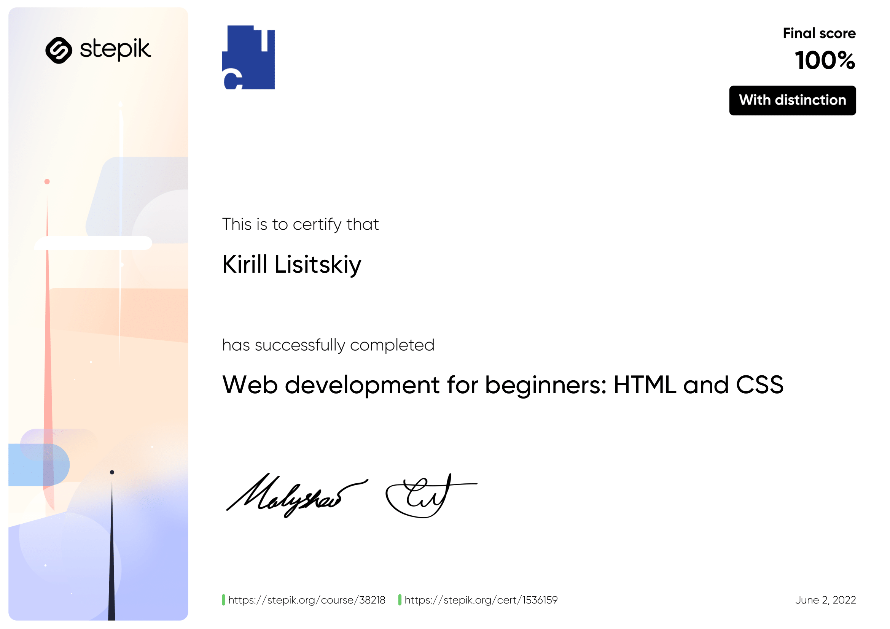
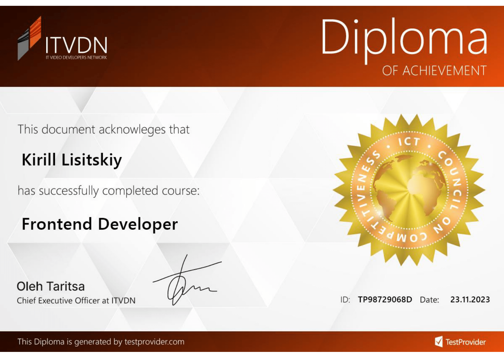
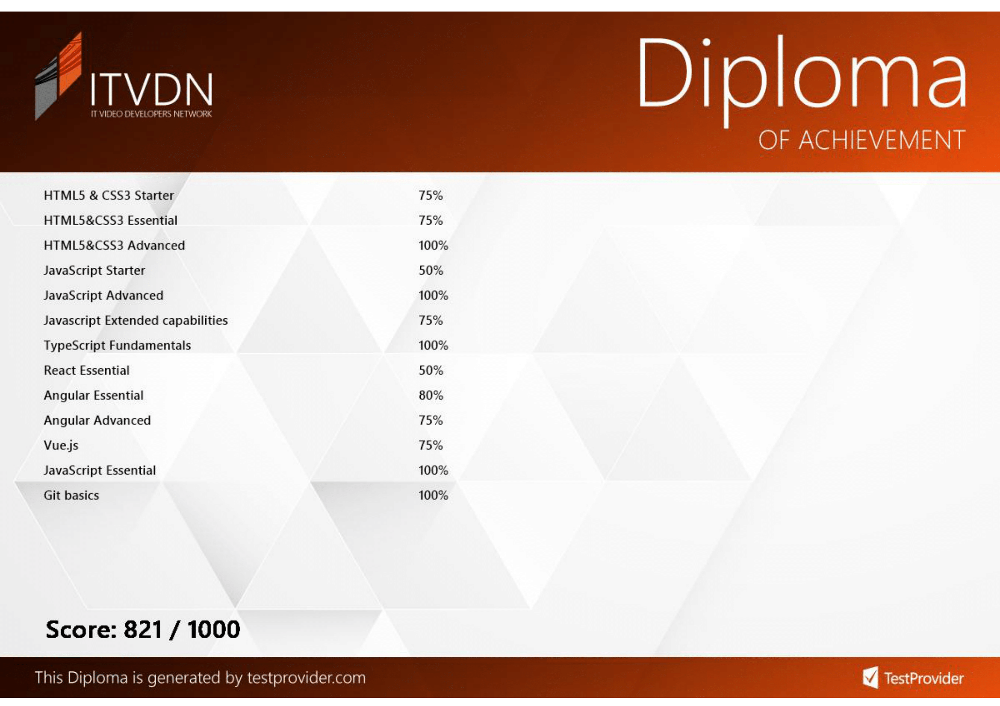

# My completed сourses and received certificates

My first certificate for the course "HTML5 & CSS3" on the Stepik platform:

The second certificate from the ITvdn company, for which it was necessary to obtain 13 sub-certificates for each topic, you can see them in the folder "Certificates for Intermediate Testing":

